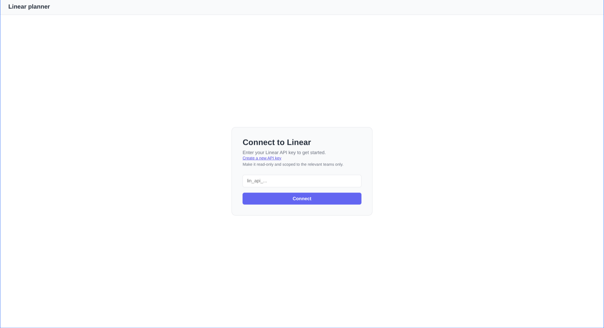
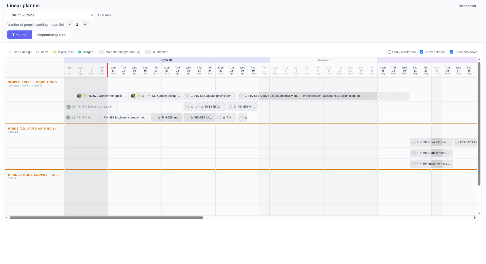
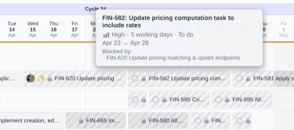
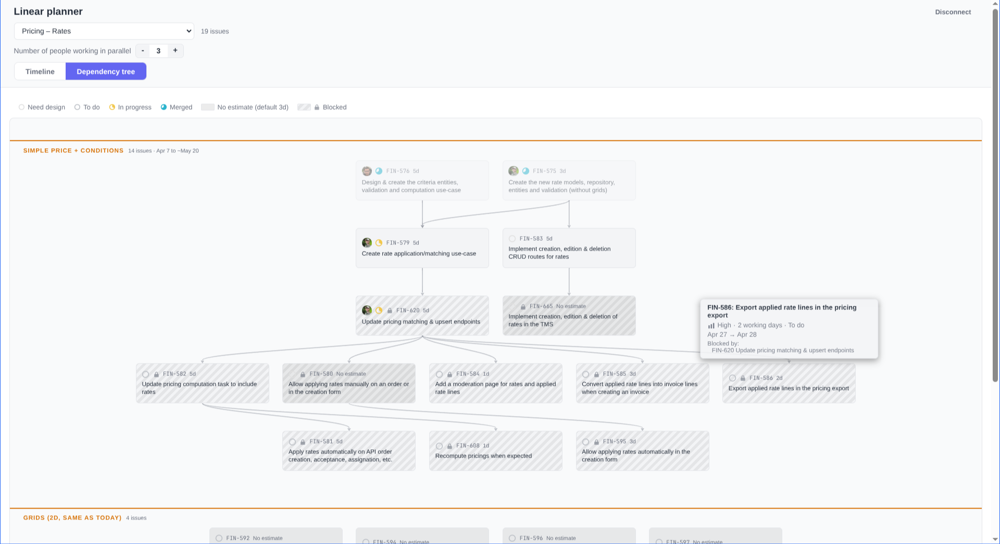

# Linear planner

A tool to visualize the parallelization and dependencies of Linear issues from a given project.

Two view modes:
- Timeline: a Gantt-like diagram dispatching tasks given a number of people working in parallel on the project.
- Dependency tree: shows vertical relationships between issues.

Both views are split vertically using Linear milestones.

The app calculates dependencies based on the 'blocked by' related status of the issues.
The time and dates of issues are either taken from Linear (date at which the ticket changed to the given status) or estimated from the 'complexity' of issues: 1 point = 1 working day for one person.
Issues that are done are shown are not considered for future scheduling and are shown in their own separate lanes in the timeline view.

## Screenshots 

Landing page:

Timeline view:

Blocked relationship:

Dependency tree view:

## Usage & data

The app is [available on my website](https://guillaumevdn.com/linear-planner/).
 
No data is stored on the app: connection is handled via a Linear API key. Using a project-scoped read-only API key is recommended.

All the projects and issues data comes from Linear, and the session key & user preferences are stored in the browser local storage.

## Stack

Made with React + TypeScript + Vite, self-hosted in a docker container.

I don't own or take responsibility for this code as it was 100% AI-written.

